Tài liệu này mô tả quy trình xác thực người dùng sử dụng **JSON Web Tokens (JWT)** trong kiến trúc microservices. Quy trình bao gồm đăng ký/đăng nhập, tạo token, kiểm soát truy cập và cơ chế làm mới token. 🎉

## Tổng Quan 🌟

Hệ thống xác thực sử dụng JWT với thuật toán **RSA256** để bảo mật truy cập người dùng. Có hai loại token chính:

- **Access Token**: Token ngắn hạn, được gửi trong header `Authorization` để truy cập tài nguyên bảo vệ. 🔑
- **Refresh Token**: Token dài hạn, lưu trong cookie HttpOnly, dùng để tạo lại access token khi hết hạn. 🔄

Hệ thống sử dụng cặp khóa công khai - bí mật (`private-key.pem` và `public-key.pem`) để ký và xác minh token. Khóa công khai được phân phối đến các microservices để xác minh access token, đảm bảo truy cập mượt mà. 🛡️

## Quy Trình Xác Thực 📋

```mermaid
sequenceDiagram
    participant Client
    participant AuthServer as Authentication Server
    participant ResourceServer as Resource Server
    participant Database

    %% Äăng ký/Äăng nhập
    Client->>AuthServer: POST /api/v1/auth/register or /login (email, password)
    AuthServer->>Database: Validate credentials
    Database-->>AuthServer: Valid user
    AuthServer->>AuthServer: Generate access_token (RSA256, private-key.pem)
    AuthServer->>AuthServer: Generate refresh_token (RSA256, private-key.pem)
    AuthServer->>Database: Store refresh_token
    AuthServer-->>Client: { "access_token": "<JWT>" } + Set-Cookie: refresh_token (HttpOnly, Secure)

    %% Truy cập tài nguyên bảo vệ
    Client->>ResourceServer: GET /api/v1/desks (Authorization: Bearer <access_token>)
    ResourceServer->>ResourceServer: AccessTokenFilter: Verify token (public-key.pem)
    alt Token valid
        ResourceServer->>Database: Fetch user data (e.g., desks)
        Database-->>ResourceServer: User data
        ResourceServer-->>Client: User data (JSON)
    else Token invalid/missing
        ResourceServer-->>Client: 401 Unauthorized
    end

    %% Làm mới token
    Client->>AuthServer: POST /api/v1/auth/refresh (Cookie: refresh_token)
    AuthServer->>Database: Verify refresh_token
    alt Refresh token valid
        AuthServer->>AuthServer: Generate new access_token
        AuthServer->>AuthServer: (Optional) Generate new refresh_token
        AuthServer->>Database: Update refresh_token
        AuthServer-->>Client: { "access_token": "<NEW_JWT>" } + (Optional) New refresh_token cookie
    else Refresh token invalid
        AuthServer-->>Client: 401 Unauthorized
    end
```



### 1. Đăng Ký hoặc Đăng Nhập 👤

- **API**: `/api/v1/auth/register` hoặc `/api/v1/auth/login`
- **Quy trình**:
  - Client gửi yêu cầu POST với thông tin đăng nhập (email, mật khẩu). 📧
  - Server xác thực thông tin.
  - Nếu thành công, server tạo:
    - **Access Token** bằng `AccessTokenJwtService`. 🔐
    - **Refresh Token** bằng `RefreshTokenJwtService`. 🔄
  - **Phản hồi**:
    - JSON chứa access token:
      ```json
      {
        "access_token": "<JWT_ACCESS_TOKEN>"
      }
      ```
    - Refresh token được đặt trong cookie HttpOnly với các thuộc tính:
      - **Tên**: `refresh_token`
      - **HttpOnly**: `true` (ngăn truy cập từ JavaScript) 🚫
      - **Secure**: `true` (chỉ gửi qua HTTPS) 🔒
      - **SameSite**: `Strict` (chống CSRF) 🛑
      - **Path**: `/` (khả dụng toàn domain) 🌐
      - **Max-Age**: Thời hạn tùy chỉnh (VD: 24 giờ) ⏳
    - Ví dụ mã tạo cookie (Java - Spring):
      ```java
      ResponseCookie cookie = ResponseCookie.from("refresh_token", refreshToken)
          .httpOnly(true)
          .secure(true)
          .sameSite("Strict")
          .path("/")
          .maxAge(Duration.ofHours(refreshTokenDuration))
          .build();
      response.addHeader(HttpHeaders.SET_COOKIE, cookie.toString());
      ```

### 2. Tạo Token 🔨

- **Thuật toán**: RSA256 (có thể tùy chỉnh sang RSA384 hoặc RSA512). ⚙️
- **Khóa**:
  - **Khóa bí mật** (`private-key.pem`): Dùng để ký access và refresh token. 🔑
  - **Khóa công khai** (`public-key.pem`): Dùng để xác minh token, được chia sẻ cho microservices. 📤
- **Payload của Access Token**:
  - Chứa thông tin người dùng dạng JSON và các claim riêng:
    ```json
    {
      "user": "{\"user_email\":\"phamducluu2003@gmail.com\",\"user_name\":\"Pham Duc Luu\",\"user_id\":\"10\",\"user_uuid\":\"7d1b9692-ee75-11ef-bda1-0242ac110002\"}",
      "user_email": "phamducluu2003@gmail.com",
      "user_name": "phamducluu2003@gmail.com"
    }
    ```
  - Có thời hạn (VD: 1 giờ). ⏰
- **Refresh Token**:
  - Cấu trúc payload tương tự, nhưng thời hạn dài hơn (VD: 24 giờ). 🕰️
  - Lưu an toàn trên server để xác minh khi làm mới token. 💾
- **Mã ví dụ** (Tạo Access Token):
  ```java
  public String genToken(UserJWTObject userJWTObject) throws HttpResponseException {
      return JWT.create()
          .withClaim(JwtClaims.User.getClaimName(), userJWTObject.toJson())
          .withClaim(JwtClaims.USER_EMAIL.getClaimName(), userJWTObject.getUser_email())
          .withClaim(JwtClaims.USER_NAME.getClaimName(), userJWTObject.getUser_email())
          .withIssuedAt(Instant.now())
          .withExpiresAt(Instant.now().plus(Duration.ofHours(Long.parseLong(tokenDurationInHour))))
          .sign(algorithm);
  }
  ```

### 3. Truy Cập Tài Nguyên Bảo Vệ 🗄️

- **API**: Các tài nguyên bảo vệ (VD: `/api/v1/desks`, `/api/v1/images`).
- **Yêu cầu**:
  - Client phải đính kèm access token trong header `Authorization`:
    ```
    Authorization: Bearer <JWT_ACCESS_TOKEN>
    ```
- **Bộ lọc (Filter)**:
  - Các yêu cầu tới API bảo vệ (VD: `/api/v1/*`) đi qua `AccessTokenFilter`. 🚨
  - Bộ lọc:
    - Trích xuất token từ header `Authorization`. 🔍
    - Xác minh token bằng khóa công khai qua `AccessTokenJwtService.verify()`. ✅
    - Kiểm tra tính hợp lệ (VD: chưa hết hạn, chữ ký hợp lệ). ✔️
    - Nếu hợp lệ, trích xuất claim (VD: `user_email`, `user_name`) và đặt vào thuộc tính yêu cầu. 📋
    - Nếu không hợp lệ hoặc thiếu token, trả về lỗi 401 Unauthorized:
      ```json
      {
        "status": 401,
        "error": "Unauthorized",
        "message": "Missing access token",
        "path": "<REQUEST_URI>"
      }
      ```
  - Các API miễn kiểm tra (VD: `/api/v1/auth/*`, `/api/v1/graphql/*`) không qua bộ lọc. 🚪
- **Mã ví dụ** (Logic Bộ lọc):

  ```java
  public void doFilter(ServletRequest request, ServletResponse response, FilterChain chain) throws IOException, ServletException {
      HttpServletRequest httpRequest = (HttpServletRequest) request;
      String token = httpHeaderUtil.extractTokenFromHeader(httpRequest);
      boolean isProtected = protectedUrlPatterns.stream()
          .anyMatch(pattern -> pattern.matcher(httpRequest.getRequestURI()).matches());
      boolean isExclude = excludedUrlPatterns.stream()
          .anyMatch(pattern -> pattern.matcher(httpRequest.getRequestURI()).matches());

      if (isProtected && !isExclude) {
          if (token == null) {
              HttpErrorDto errorResponse = new HttpErrorDto(
                  HttpStatus.UNAUTHORIZED.value(),
                  HttpStatus.UNAUTHORIZED.getReasonPhrase(),
                  "Missing access token",
                  httpRequest.getRequestURI()
              );
              httpResponse.setStatus(HttpStatus.UNAUTHORIZED.value());
              response.setContentType("application/json");
              try (PrintWriter writer = response.getWriter()) {
                  writer.write(httpHeaderUtil.errorResponseToJson(errorResponse));
              }
              return;
          }
          try {
              DecodedJWT decodedJWT = accessTokenJwtService.verify(token);
              Claim email_claim = decodedJWT.getClaim(JwtClaims.USER_EMAIL.getClaimName());
              httpRequest.setAttribute("email", email_claim.asString());
          } catch (JWTVerificationException e) {
              HttpErrorDto errorResponse = new HttpErrorDto(
                  HttpStatus.UNAUTHORIZED.value(),
                  HttpStatus.UNAUTHORIZED.getReasonPhrase(),
                  e.getMessage(),
                  httpRequest.getRequestURI()
              );
              httpResponse.setStatus(HttpStatus.UNAUTHORIZED.value());
              response.setContentType("application/json");
              try (PrintWriter writer = response.getWriter()) {
                  writer.write(httpHeaderUtil.errorResponseToJson(errorResponse));
              }
              return;
          }
      }
      chain.doFilter(request, response);
  }
  ```

### 4. Làm Mới Token 🔄

- **API**: `/api/v1/auth/refresh`
- **Quy trình**:
  - Khi access token hết hạn, client gửi yêu cầu với refresh token (lưu trong cookie HttpOnly). 📬
  - Server:
    - Xác minh refresh token bằng `RefreshTokenJwtService.verify()` so với token lưu trên server. 🔎
    - Nếu hợp lệ, tạo access token mới bằng `AccessTokenJwtService.genToken()`. 🆕
    - Trả về access token mới:
      ```json
      {
        "access_token": "<NEW_JWT_ACCESS_TOKEN>"
      }
      ```
    - Có thể tạo refresh token mới và cập nhật cookie. 🔄
  - Nếu refresh token không hợp lệ hoặc hết hạn, client phải đăng nhập lại. 🚪
- **Bảo mật**:
  - Refresh token được lưu an toàn trên server để ngăn truy cập trái phép. 🔐
  - Thuộc tính HttpOnly và Secure của cookie bảo vệ refresh token khỏi script phía client và chỉ truyền qua HTTPS. 🛡️

## Tích Hợp Microservices 🌐

- **Phân phối khóa công khai**:
  - `public-key.pem` được chia sẻ cho tất cả microservices để xác minh access token. 📤
  - Mỗi microservice dùng khóa công khai để giải mã access token và lấy payload (VD: `user_email`, `user_id`) để phân quyền. 🔍
- **Sử dụng Payload**:
  - Claim `user` chứa chuỗi JSON với thông tin chi tiết:
    ```json
    {
      "user_email": "phamducluu2003@gmail.com",
      "user_name": "Pham Duc Luu",
      "user_id": "10",
      "user_uuid": "7d1b9692-ee75-11ef-bda1-0242ac110002"
    }
    ```
  - Microservices phân tích payload để phân quyền và cá nhân hóa yêu cầu. 🎯

## Các Yếu Tố Bảo Mật 🔒

- **Cookie HttpOnly và Secure**: Ngăn tấn công XSS và đảm bảo truyền tải an toàn. 🛡️
- \*\*SameSite=Strict /

\*\*: Chống tấn công CSRF. 🚫

- **Access Token ngắn hạn**: Giảm rủi ro nếu token bị rò rỉ. ⏳
- **Lưu trữ Refresh Token**: Lưu an toàn trên server ngăn tái tạo token trái phép. 💾
- **Thuật toán RSA256**: Cung cấp bảo mật mã hóa mạnh mẽ. 🔐
- **Loại trừ bộ lọc**: Đảm bảo các API công khai (như API xác thực) luôn truy cập được mà không cần token. 🚪

## Kết Luận 🎉

Quy trình xác thực dựa trên JWT này cung cấp giải pháp bảo mật và mở rộng cho việc xác thực người dùng trong môi trường microservices. Với RSA256, cookie HttpOnly và cơ chế bộ lọc mạnh mẽ, hệ thống đảm bảo truy cập an toàn vào tài nguyên bảo vệ đồng thời duy trì khả năng làm mới token mượt mà. 🌟
