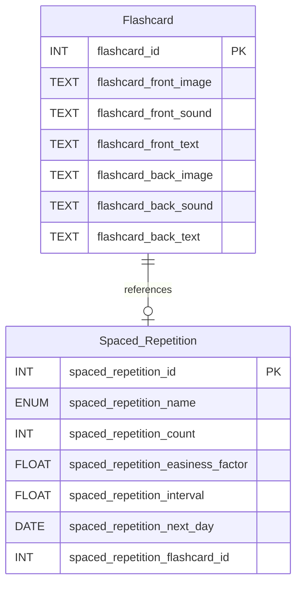

Thuật toán **SM-2** (SuperMemo 2) là một thuật toán lặp lại ngắt quãng (spaced repetition) được phát triển bởi Piotr Woźniak vào năm 1985. Nó được thiết kế để tối ưu hóa việc học và ghi nhớ thông tin lâu dài bằng cách lên lịch ôn tập vào những thời điểm lý tưởng, dựa trên mức độ khó của nội dung và hiệu suất học tập của người dùng. Thuật toán này được sử dụng rộng rãi trong các ứng dụng học tập như Anki, Quizlet, và các hệ thống flashcard. 🚀

## Giới Thiệu về Thuật Toán SM-2 🌟

SM-2 dựa trên nguyên lý rằng việc ôn tập thông tin ngay trước khi quên sẽ tăng cường khả năng ghi nhớ lâu dài. Thuật toán sử dụng các yếu tố sau để điều chỉnh lịch trình ôn tập:

- **Easiness Factor (EF)**: Độ dễ của flashcard, ảnh hưởng đến khoảng thời gian giữa các lần ôn tập.
- **Interval**: Khoảng thời gian (tính bằng ngày) trước lần ôn tập tiếp theo.
- **Review Count**: Số lần flashcard đã được ôn tập.
- **Grade**: Điểm chất lượng (0-5) mà người dùng đánh giá sau mỗi lần ôn tập, phản ánh mức độ ghi nhớ.

SM-2 tính toán thời điểm ôn tập tiếp theo dựa trên hiệu suất của người dùng, đảm bảo rằng các flashcard khó được ôn tập thường xuyên hơn, trong khi các flashcard dễ được ôn tập với khoảng cách dài hơn. 📅

## Cách Thuật Toán Hoạt Động ⚙️

Thuật toán SM-2 hoạt động qua các bước sau:

1. **Khởi tạo**:

   - Mỗi flashcard mới có:
     - **Easiness Factor (EF)**: Mặc định là 2.5.
     - **Interval**: 0 (chưa ôn tập).
     - **Review Count**: 0.
     - **Next Review Date**: Ngày hiện tại.

2. **Ôn tập và đánh giá**:

   - Người dùng ôn tập flashcard và đánh giá chất lượng ghi nhớ bằng điểm **grade** (0-5):
     - 0: Hoàn toàn quên.
     - 1-2: Nhớ một phần nhưng khó khăn.
     - 3: Nhớ đúng nhưng cần nỗ lực.
     - 4: Nhớ dễ dàng.
     - 5: Nhớ hoàn hảo.

3. **Cập nhật Easiness Factor**:

   - EF được điều chỉnh dựa trên grade:
     ```
     EF = EF + (0.1 - (5 - grade) * (0.08 + (5 - grade) * 0.02))
     ```
   - EF tối thiểu là 1.3 để tránh khoảng thời gian ôn tập quá ngắn.
   - EF cao hơn nghĩa là flashcard dễ hơn, dẫn đến khoảng thời gian ôn tập dài hơn.

4. **Cập nhật Interval**:

   - Nếu **grade ≥ 3** (ôn tập thành công):
     - Lần ôn tập đầu tiên (`count = 0`): Interval = 1 ngày.
     - Lần ôn tập thứ hai (`count = 1`): Interval = 2 ngày.
     - Các lần tiếp theo: `Interval = Interval * EF`.
   - Nếu **grade < 3** (ôn tập thất bại): Interval = 1 ngày (quay lại ôn tập sớm).

5. **Cập nhật Next Review Date**:

   - Ngày ôn tập tiếp theo được tính: `Next Review Date = Current Date + Interval`.

6. **Tăng Review Count**:

   - Sau mỗi lần ôn tập, `Review Count` tăng lên 1.

7. **Lưu trữ**:
   - Các giá trị được cập nhật vào cơ sở dữ liệu để sử dụng trong lần ôn tập tiếp theo.

## Áp Dụng vào Ứng Dụng 📱

SM-2 được áp dụng vào hệ thống flashcard với cơ sở dữ liệu và mã Java như sau:

### Cấu Trúc Cơ Sở Dữ Liệu

1. **Bảng Flashcard**:

   - Lưu trữ thông tin của flashcard (mặt trước và mặt sau).
   - Cấu trúc:
     ```sql
     CREATE TABLE Flashcard (
         flashcard_id INT PRIMARY KEY,
         flashcard_front_image TEXT,
         flashcard_front_sound TEXT,
         flashcard_front_text TEXT,
         flashcard_back_image TEXT,
         flashcard_back_sound TEXT,
         flashcard_back_text TEXT
     )
     ```

2. **Bảng Spaced_Repetition**:

   - Lưu trữ thông tin về lịch trình ôn tập cho mỗi flashcard.
   - Cấu trúc:
     ```sql
     CREATE TABLE Spaced_Repetition (
         spaced_repetition_id INT PRIMARY KEY AUTO_INCREMENT,
         spaced_repetition_name ENUM('SM-2'),
         spaced_repetition_count INT,
         spaced_repetition_easiness_factor FLOAT,
         spaced_repetition_interval FLOAT,
         spaced_repetition_next_day DATE,
         spaced_repetition_flashcard_id INT UNIQUE,
         FOREIGN KEY (spaced_repetition_flashcard_id) REFERENCES Flashcard(flashcard_id)
     )
     ```

3. **Mô hình hóa**



### Mã Java Thực Thi SM-2

Mã sau triển khai thuật toán SM-2 để cập nhật lịch trình ôn tập dựa trên điểm **grade** của người dùng:

```java
public SpacedRepetitionRecord triggerSM_2_algorithm(SpacedRepetitionRecord spacedRepetitionRecord, int grade) {
    // Get current values
    double easinessFactor = spacedRepetitionRecord.getSpacedRepetitionEasinessFactor();
    int count = spacedRepetitionRecord.getSpacedRepetitionCount();
    double interval = spacedRepetitionRecord.getSpacedRepetitionInterval();
    LocalDate nextDay = spacedRepetitionRecord.getSpacedRepetitionNextDay();

    // Adjust easiness factor based on the grade (0 to 5)
    easinessFactor = easinessFactor + (0.1 - (5 - grade) * (0.08 + (5 - grade) * 0.02));
    if (easinessFactor < 1.3) {
        easinessFactor = 1.3; // Enforce a minimum easiness factor
    }
    logger.debug(grade);

    if (grade >= 3) {
        // Update the interval and next review date
        if (count == 0) {
            interval = 1; // For the first review, the interval is 1 day
        } else if (count == 1) {
            interval = 2; // After the second review, the interval is 2 days
        } else {
            interval = interval * easinessFactor; // Update the interval with the easiness factor
        }
    } else {
        interval = 1;
    }

    // Update next review date
    nextDay = LocalDate.now().plusDays((long) interval);

    // Store the updated values in the record
    spacedRepetitionRecord.setSpacedRepetitionCount(count + 1);
    spacedRepetitionRecord.setSpacedRepetitionEasinessFactor(easinessFactor);
    spacedRepetitionRecord.setSpacedRepetitionInterval(interval);
    spacedRepetitionRecord.setSpacedRepetitionNextDay(nextDay);

    spacedRepetitionRecord.update();

    return spacedRepetitionRecord;
}
```

### Cách Áp Dụng trong Ứng Dụng

1. **Tạo Flashcard**:

   - Người dùng tạo flashcard với nội dung (hình ảnh, âm thanh, văn bản) cho mặt trước và mặt sau.
   - Flashcard được lưu vào bảng `Flashcard` với `flashcard_id` duy nhất.

2. **Khởi Tạo Spaced Repetition**:

   - Khi flashcard được thêm vào bộ ôn tập, một bản ghi được tạo trong bảng `Spaced_Repetition`:
     - `spaced_repetition_name`: SM-2.
     - `spaced_repetition_count`: 0.
     - `spaced_repetition_easiness_factor`: 2.5 (mặc định).
     - `spaced_repetition_interval`: 0.
     - `spaced_repetition_next_day`: Ngày hiện tại.
     - `spaced_repetition_flashcard_id`: Tham chiếu đến `flashcard_id`.

3. **Ôn Tập Flashcard**:

   - Ứng dụng hiển thị flashcard đến hạn ôn tập (`spaced_repetition_next_day ≤ Current Date`).
   - Người dùng ôn tập và cung cấp điểm **grade** (0-5).
   - Hàm `triggerSM_2_algorithm` được gọi với bản ghi `SpacedRepetitionRecord` và **grade**:
     - Cập nhật **easiness factor**, **interval**, **next review date**, và **review count**.
     - Lưu bản ghi vào bảng `Spaced_Repetition`.

4. **Lên Lịch Ôn Tập**:

   - Ứng dụng định kỳ kiểm tra bảng `Spaced_Repetition` để lấy các flashcard có `spaced_repetition_next_day` phù hợp với ngày hiện tại.
   - Người dùng nhận thông báo hoặc danh sách flashcard cần ôn tập.

5. **Quản Lý Dữ Liệu**:
   - Mỗi flashcard chỉ có một bản ghi trong `Spaced_Repetition` (đảm bảo bởi `UNIQUE` trên `spaced_repetition_flashcard_id`).
   - Dữ liệu được lưu trữ liên tục để duy trì lịch trình ôn tập ngay cả khi ứng dụng khởi động lại.

## Lợi Ích và Hạn Chế 🌈

### Lợi Ích

- **Tối ưu hóa ghi nhớ**: SM-2 lên lịch ôn tập ngay trước khi quên, tăng hiệu quả học tập.
- **Cá nhân hóa**: Điều chỉnh khoảng thời gian ôn tập dựa trên hiệu suất của từng người dùng.
- **Đơn giản triển khai**: Thuật toán dễ tích hợp vào ứng dụng flashcard với cơ sở dữ liệu quan hệ.

### Hạn Chế

- **Phụ thuộc vào grade**: Độ chính xác của lịch trình phụ thuộc vào việc người dùng đánh giá **grade** trung thực.
- **Không linh hoạt**: SM-2 không hỗ trợ các yếu tố như độ phức tạp của nội dung hoặc bối cảnh học tập.
- **Cần cải tiến**: Các phiên bản mới hơn (SM-3, SM-4) có thể cung cấp độ chính xác cao hơn nhưng phức tạp hơn.

## Kết Luận 🎉

Thuật toán SM-2 là một công cụ mạnh mẽ để tối ưu hóa việc học tập thông qua lặp lại ngắt quãng. Với cấu trúc cơ sở dữ liệu và mã Java được cung cấp, SM-2 có thể được tích hợp dễ dàng vào ứng dụng flashcard, giúp người dùng ghi nhớ thông tin hiệu quả hơn. Việc áp dụng SM-2 không chỉ cải thiện trải nghiệm học tập mà còn đảm bảo tính cá nhân hóa và khả năng mở rộng cho các hệ thống học tập hiện đại. 🚀
