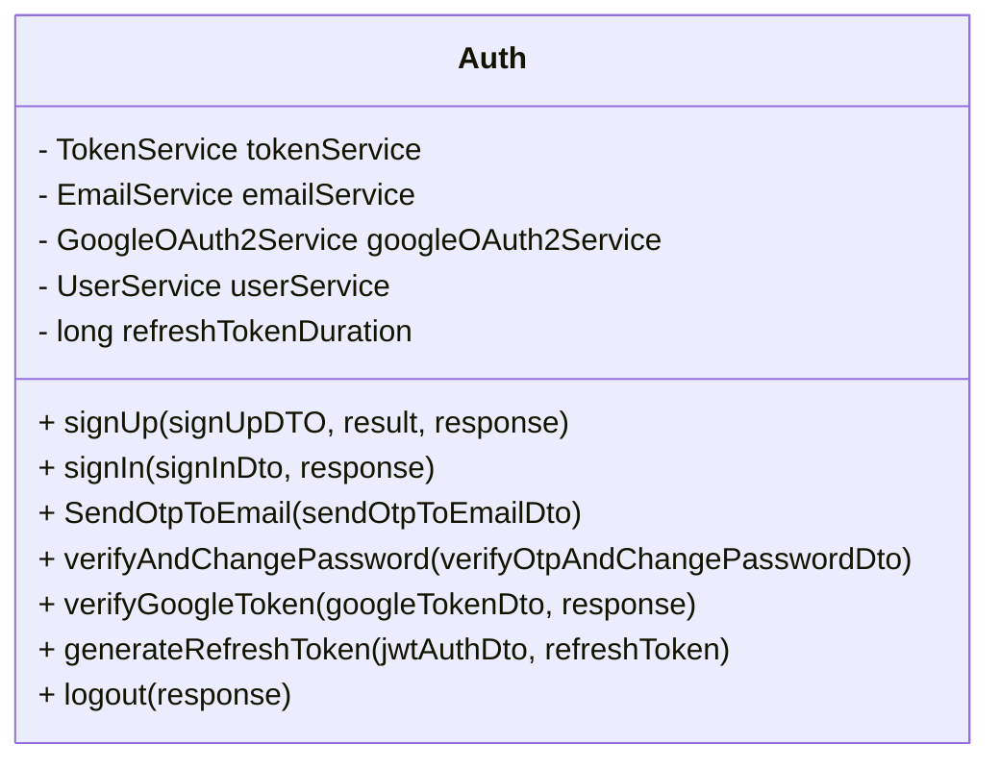

# Auth

```mermaid
classDiagram
    class Auth {
        - TokenService tokenService
        - EmailService emailService
        - GoogleOAuth2Service googleOAuth2Service
        - UserService userService
        - long refreshTokenDuration
        + signUp(signUpDTO, result, response)
        + signIn(signInDto, response)


        + SendOtpToEmail(sendOtpToEmailDto)
        + verifyAndChangePassword(verifyOtpAndChangePasswordDto)
        + verifyGoogleToken(googleTokenDto, response)
        + generateRefreshToken(jwtAuthDto, refreshToken)
        + logout(response)
    }


```
